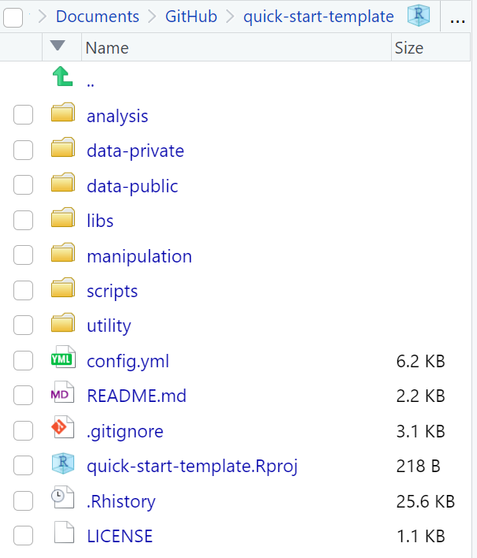
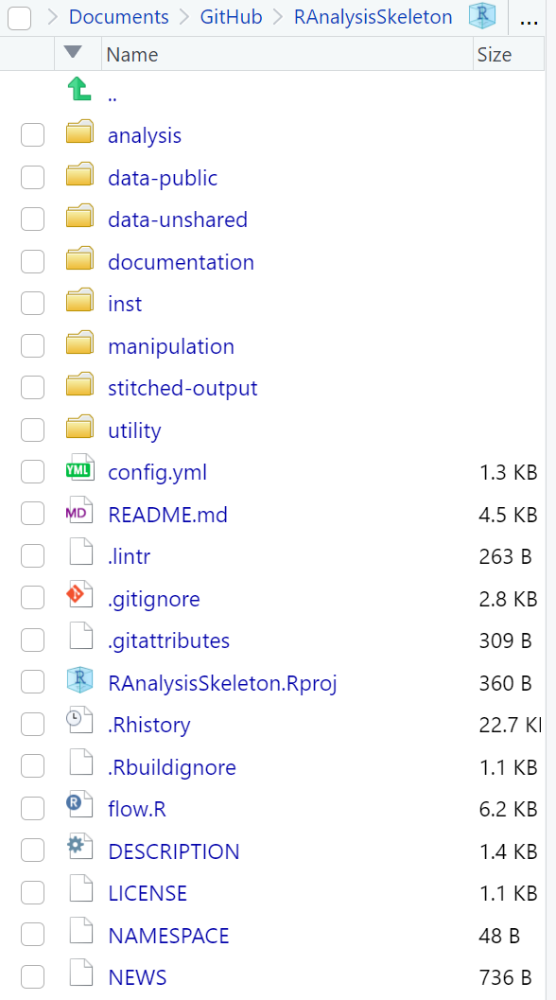

# 1. Загрози валідності (Threats to Validity)

1.1 Щоб використовувати результати аналізу даних як доказ для підтримки наших поглядів і рішень, ми маємо врахувати різні **загрози валідності** (threats to validity) висновків, зроблених на основі даних.

1.2 **Загрози валідності** — це чинники або обставини, що можуть підірвати точність, достовірність або узагальнюваність результатів дослідження. Такі загрози можуть внести **упередження** (biases) або помилки в процес дослідження, що призводить до хибних висновків або обмеженої застосовності результатів.

1.3 [Shadish, Cook, and Campbell (2002)](https://psycnet.apa.org/record/2002-17373-000) виділили чотири основні категорії **загроз валідності**:

[](https://mermaid.live/edit#pako:eNqVksFu2zAMhl-F4K52YDmO42jAgK0NsAIdNsxFDpt3ECymEWpLniUj8YK8e2UHzepgh_UmkT__j6R0xNJIQo6PrWh2cP-90ACbnwVuRKWkcn2Bv8YQhCEUeKcdtVpU8DftEx_gbij5rKwzbR_AF-G6VjhldAA5VVQOx6nR-vBvo_VgNFLEWAVmCw9kndKPILSEh5aEq0m7AK5UF9BUN8XeGG1d25Xumntz5gpJvzvhCG5pq7R68b6UWT-c0Sb82tB5QPikhJ0ycuczvuPST-cLy6qzg_AKmA_Ae7OHb2ZPbQAbZSoPlvDR2q5uBm87jvXKbVjEC6xS-il3fUUQge_NPBF_F1Mplyw4X8O9km7H4-bwfqpnb9THb9TP_0OPAdbU1kJJ__WOQ32Bbkc1Fcj9UdJWdJV_u0KfvFR0zuS9LpH7R6AAu0b6Vd0q4T9tjXwrKnuJrv2OTXsJNkL_MKZ-fUd-xAPyMFlls5RlabaK50kUpfMAe-RxGs9ixhbJYsXSZLGITwH-GR3YLEujJI5YtMwSlqzY8vQMkuoTnQ)

1.4 Кожну з цих широких категорій можна додатково розділити на специфічні загрози, які ми запрошуємо переглянути [тут](../../analysis/analysis-templatization/threats-to-validity.htm) або за допомогою наступного запиту (prompt):

> Запит: Перелічіть специфічні загрози валідності в межах кожної широкої категорії, описаної (Shadish, Cook, and Campbell, 2002).

1.5 Загалом, основна мета в дослідженні — мінімізувати ці загрози, щоб забезпечити значущість і застосовність результатів дослідження.

# 2. Грамотне програмування (Literate Programming)

2.1 Після 2002 року дослідники та аналітики розширили цю таксономію, запропонувавши нові **загрози валідності**, що відображали та вирішували проблеми у нарощуючому середовищі **великих даних** (big data) і **дешевих обчислень** (cheap computing). Відсутні та неточні дані, наприклад, стали більш актуальними в аналізах, що спираються на *великі спостережні дані* (big observational data), на відміну від тих [аналізів], що працюють з акуратними структурами даних рандомізованих експериментів. Інші такі загрози включали проблеми, пов'язані з **походженням даних** (data provenance) (джерело та збір), **перепідлаштуванням моделі** (model overfitting), **упередженістю алгоритмів** (algorithm bias), **відтворюваністю** (reproducibility) та **контролем версій** (version control), серед інших. Великі дані також принесли нові виклики для впровадження аналізу даних.

> Запит: [Shadish, Cook, and Campbell (2002)](https://psycnet.apa.org/record/2002-17373-000) описують чотири широкі категорії загроз валідності. Які інші загрози валідності були запропоновані з того часу? Обов'язково включіть ті, що виникли внаслідок зростання великих даних.

2.2 Більші, складніші дані додали більше необхідних рівнів абстракцій (**реляційні структури** (relational structures), **мови програмування** (programming languages), **математичні моделі** (mathematical models)) до практики аналізу даних під час дослідницької діяльності і таким чином збільшили "відстань", яку дослідник має подолати між чіткими, перевірними **знахідками** (findings) простою мовою та доказом таких тверджень, підтриманих **доказами** (evidence) в даних.

2.3 Однією з відповідей на нові виклики була популяризація **грамотного програмування** (literate programming) — методології, яка запрошує розглядати програму як твір літератури, де код вбудований у пояснювальний текст, подібно до технічного документа або наукової статті. Грамотне програмування заохочує програмістів писати код і супутні пояснення у вигляді цілісного наративу, роблячи його легшим для розуміння іншими (включаючи майбутнє себе) логіки, що стоїть за кодом. Це включає організацію коду в логічні розділи або "чанки" (chunks) і надання детальних пояснень, мотивацій та інсайтів на кожному кроці. З'явились нові програмні інструменти для допомоги в цих завданнях.

2.4 Популярним інструментом для практики грамотного програмування є **система грамотного програмування** (literate programming system) (наприклад, Jupyter Notebook, RStudio, noweb), що підтримує інтеграцію коду та документації. Ці інструменти дозволяють аналітикам даних і статистикам писати документ, що поєднує код, математичні формули, пояснювальний текст і візуалізації — все в єдиному цілісному форматі. Однак виклики цього підходу включають управління та організацію програмних скриптів різної довжини та призначення. Саме це намагається вирішити **темплатизація** (templatization).

# 3. Темплатизація (Templatization)

3.1 Зіткнувшись з необхідністю управляти грамотними скриптами для надання доказів аналітичних висновків, ми стикаємося з новими концептуальними та технічними викликами, пов'язаними з **відтворюваністю** (reproducibility), **контролем версій** (version control), **структурою документації** (documentation structure), **інструментарієм** (tooling) та **співпрацею** (collaboration) в нашому дослідницькому підприємстві. Ми можемо виділити два широких класи/рівні **шаблонів** (templates), спрямованих допомогти нам у вирішенні цих викликів:

-   **Рівень скрипта** (Script-level): Ці техніки та практики допомагають нам знайти баланс між кодом і пояснювальним текстом, інтегруючи значущий наратив і відтворювані докази в межах окремих скриптів.

-   **Рівень проєкту** (Project-level): Ці підходи та методи зосереджуються на пакуванні грамотних скриптів для забезпечення відтворюваності, зрозумілості та масштабованості дослідницьких проєктів.

## 3.2 Рівень скрипта (Script-Level)

3.2.1 Шаблони рівня скрипта кодифікують і втілюють різноманітні техніки та практики для створення самостійних, монотематичних аналітичних наративів. Вони охоплюють кілька аспектів, включаючи механіку використання інструменту, **управління чанками** (chunk management), **композицію історії** (story composition) та послідовність програмних кроків.

3.2.2 **Механіка виробництва** (Production Mechanics): Шаблони рівня скрипта надають керівництво щодо ефективного використання обраного інструменту грамотного програмування. Вони охоплюють такі аспекти, як створення та організація документа, вбудовування коду та пояснювального тексту, **опції форматування** (formatting options) та **компіляція** (compiling) або виконання скрипта для генерації бажаного виводу. Ці шаблони пропонують інструкції та приклади, щоб допомогти аналітикам даних і статистикам орієнтуватися в можливостях інструменту та використовувати їх для створення переконливих і читабельних аналітичних наративів.

3.2.3 **Управління чанками** (Chunk Management): Управління чанками включає структурування скрипта шляхом поділу його на логічні розділи або чанки. Шаблони рівня скрипта направляють авторів у тому, як визначити послідовність і розташування цих чанків. Вони надають рекомендації щодо того, коли показувати або приховувати код та/або результати, дозволяючи авторам контролювати рівень деталізації, представлений читачеві. Шаблони також можуть пропонувати найкращі практики для **маркування чанків** (chunk labeling), **перехресних посилань** (cross-referencing) та навігації, покращуючи загальний користувацький досвід для читачів скрипта.

3.2.4 **Драматургія звіту** (Report Dramaturgy): Драматургія звіту стосується структурування та композиції звіту таким чином, щоб залучити читача, ефективно передати процес аналізу та донести значущість знахідок. Вона включає застосування принципів **сторітелінгу** (storytelling) та наративних технік для представлення аналізу даних у переконливій і цілісній манері. Це — мистецтво упорядкування та організації елементів аналітичного звіту для створення значущого та впливового досвіду для аудиторії.

## 3.3 Рівень проєкту (Project-Level)

3.3.1 Шаблони рівня проєкту надають **фреймворк** (framework) для організації та структурування колекції взаємопов'язаних грамотних скриптів, полегшуючи управління та поширення проєкту в цілому.

3.3.2 Одна функція шаблонів рівня проєкту включає встановлення **послідовних конвенцій** (consistent conventions) для організації файлів, **конвенцій найменування** (naming conventions) та **структур папок** (folder structures). Прийнявши стандартизовані практики, дослідники можуть легко орієнтуватися та знаходити специфічні скрипти або розділи коду в межах проєкту. Така організація покращує співпрацю та полегшує іншим розуміння та відтворення дослідження.

|                                                     |                                                       |
|----------------------------------------|--------------------------------|
| github.com/GovAlta/quick-start-template             | github.com/wibeasley/RAnalysisSkeleton                |
| {width="317"} | {width="318"} |

: Таблиця: Два приклади шаблонів для файлової архітектури відтворюваних проєктів

3.3.3 Додатково, шаблони рівня проєкту можуть включати керівні принципи для управління **залежностями та програмними середовищами** (dependencies and software environments). Документуючи специфічні версії бібліотек, пакетів і програмного забезпечення, використаних у проєкті, дослідники можуть забезпечити, що інші зможуть відтворити те саме **обчислювальне середовище** (computational environment). Це критично важливо для реплікації результатів і сприяння прозорості в дослідницькому процесі.

3.3.4 Крім того, шаблони рівня проєкту можуть включати **стратегії для управління джерелами даних** (strategies for managing data sources), включаючи процедури **попередньої обробки** (preprocessing) та **очищення даних** (data cleaning). Документуючи кроки, вжиті для трансформації сирих даних у набори даних, готові для аналізу, дослідники можуть забезпечити, що **конвеєр обробки даних** (data processing pipeline) добре задокументований і відтворюваний. Це дозволяє іншим розуміти та відтворювати кроки підготовки даних, що призводить до прозорого та надійного аналізу.

3.3.5 З точки зору **масштабованості** (scalability), шаблони рівня проєкту можуть надати керівництво щодо структурування проєкту для розміщення більших наборів даних, додаткових аналізів або еволюціонуючих дослідницьких питань. Це може включати **модуляризацію** (modularizing) коду в багаторазові функції або бібліотеки, дозволяючи дослідникам будувати та розширювати проєкт з часом без дублювання зусиль. Прийнявши масштабовані практики, дослідники можуть ефективно управляти складними та еволюціонуючими проєктами.

# 4. Глосарій ключових термінів

| Українською                                | English (used in text)                 |
|-------------------------------------------|----------------------------------------|
| **Темплатизація аналізу**                | analysis templatization                |
| **Загрози валідності**                   | threats to validity                    |
| **Упередження**                          | biases                                 |
| **Грамотне програмування**               | literate programming                   |
| **Великі дані**                          | big data                               |
| **Дешеві обчислення**                    | cheap computing                        |
| **Походження даних**                     | data provenance                        |
| **Перепідлаштування моделі**             | model overfitting                      |
| **Упередженість алгоритмів**             | algorithm bias                         |
| **Відтворюваність**                      | reproducibility                        |
| **Контроль версій**                      | version control                        |
| **Реляційні структури**                  | relational structures                  |
| **Мови програмування**                   | programming languages                  |
| **Математичні моделі**                   | mathematical models                    |
| **Знахідки**                             | findings                               |
| **Докази**                               | evidence                               |
| **Система грамотного програмування**     | literate programming system            |
| **Чанки**                                | chunks                                 |
| **Шаблони**                              | templates                              |
| **Рівень скрипта**                       | script-level                           |
| **Рівень проєкту**                       | project-level                          |
| **Управління чанками**                   | chunk management                       |
| **Композиція історії**                   | story composition                      |
| **Механіка виробництва**                 | production mechanics                   |
| **Опції форматування**                   | formatting options                     |
| **Компіляція**                           | compiling                              |
| **Маркування чанків**                    | chunk labeling                         |
| **Перехресні посилання**                 | cross-referencing                      |
| **Драматургія звіту**                    | report dramaturgy                      |
| **Сторітелінг**                          | storytelling                           |
| **Фреймворк**                            | framework                              |
| **Послідовні конвенції**                 | consistent conventions                 |
| **Конвенції найменування**               | naming conventions                     |
| **Структури папок**                      | folder structures                      |
| **Залежності та програмні середовища**   | dependencies and software environments |
| **Обчислювальне середовище**             | computational environment              |
| **Стратегії для управління джерелами даних** | strategies for managing data sources |
| **Попередня обробка**                    | preprocessing                          |
| **Очищення даних**                       | data cleaning                          |
| **Конвеєр обробки даних**                | data processing pipeline               |
| **Масштабованість**                      | scalability                            |
| **Модуляризація**                        | modularizing                           |
